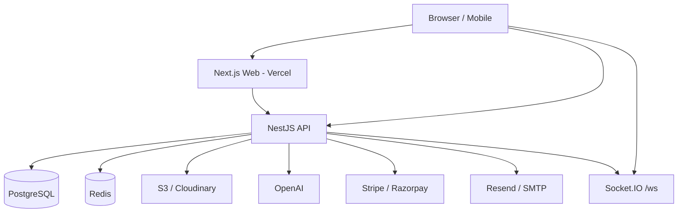

# TechAI Architecture

## Goals

Build a single platform that operates like Simform / GeekyAnts / Appinventiv: public brand site + internal ops (CRM, PM, HR, Finance) + client portal + AI assistants.

## System diagram

## Clean architecture (API)

1. **Controllers** — HTTP / WS adapters, DTO validation  
2. **Services** — business rules, orchestration  
3. **Prisma** — persistence (repository role)  
4. **Guards / Filters / Interceptors** — cross-cutting (auth, RBAC, errors, response shape)

## Frontend architecture

- Route groups: `(marketing)`, `(auth)`, role panels (`admin`, `client`, `employee`, `crm`, `pm`, `hr`, `finance`, `cms`, `ai`)
- Feature UI in `components/dashboard` + `components/marketing`
- Server Components for marketing SEO; Client Components for interactive panels
- TanStack Query for server state; Zustand for auth session

## RBAC

Roles map to workspaces via `ROLE_WORKSPACES`. API enforces `@Roles()` independently of UI — UI hiding is not security.

## Multi-tenancy note

Current schema is single-agency. Extend with `Organization` / `tenantId` on core tables when productizing for multiple agencies.

## Caching

Redis for session/blacklist and hot list endpoints. Invalidate on writes in services that mutate cached keys.

## Observability (recommended next)

- OpenTelemetry traces on API
- Structured JSON logs
- Sentry on web + api
